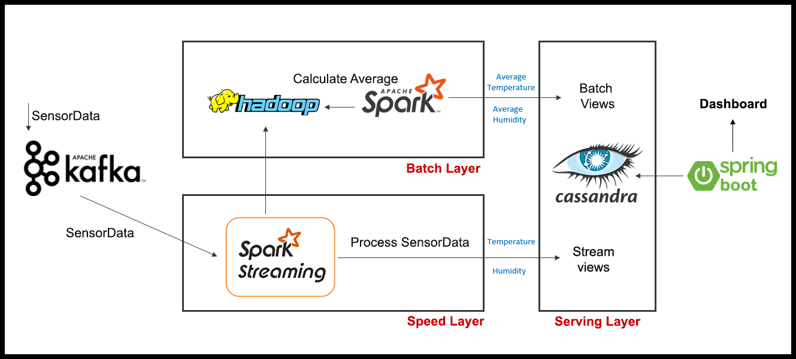
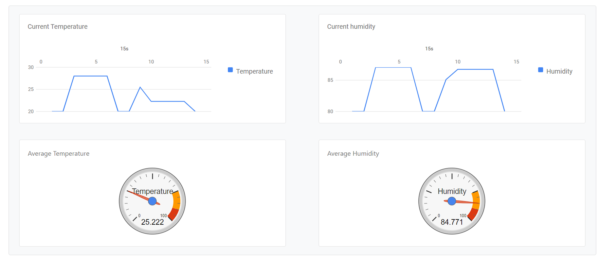

For this project we used :  
- Spark, Hadoop HDFS, Docker, Java 1.8, Maven, SpringBoot, ZooKeeper, Kafka, Cassandra.

### Architecture

We used **Lambda architecture** that handles data by taking advantage of both batch and stream-processing methods.

<br><br>

Three modules for the application :

**Kafka Producer:** Simulates Realtime IoT data coming from a Sensor. It generates mock values that are sent as events to a topic in Kafka.

**Spark Processor:** Contains two Processors :
    
  - **Stream Processor** : Processes the streaming data using Kafka with Spark Streaming API. The SensorData is processed By Spark Streaming that separates it into Temperature and Humidity and stores it in Cassandra. The streamed data is appended into Hadoop HDFS for batch processing.
  
  - **Batch Processor** : Processes the batch data using Spark and storing the pre-computed views into Cassandra.

**Dashboard:** Retrieves data from the Cassandra database and sends it to a web page. 
It uses Web Sockets and jQuery to push the streamed data to the web page in fixed intervals so data will be refreshed automatically. 

### How to use

We run : 

```
docker-compose up
```

Then we create the **database schema** in Cassandra

```
docker exec cassandra-iot cqlsh --username cassandra --password cassandra -f /schema.cql
```

We create the folder to save the data for batch processing

```
docker exec namenode hdfs dfs -rm -r /lambda-arch
docker exec namenode hdfs dfs -mkdir /lambda-arch
docker exec namenode hdfs dfs -mkdir /lambda-arch/checkpoint
docker exec namenode hdfs dfs -chmod -R 777 /lambda-arch
docker exec namenode hdfs dfs -chmod -R 777 /lambda-arch/checkpoint
```

We run the **Stream** Processor
```
docker exec spark-master /spark/bin/spark-submit --class com.bigdata.spark.processor.StreamProcessor --master spark://localhost:7077 /opt/spark-data/bigdata-spark-processor-1.0.0.jar
```

We run the **Batch** Processor
```
docker exec spark-master /spark/bin/spark-submit --class com.bigdata.spark.processor.BatchProcessor --master spark://localhost:7077 /opt/spark-data/bigdata-spark-processor-1.0.0.jar
```

The **dashboard** can be viewed on
```
localhost:3000
```

<br><br>